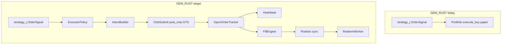

# Plan: CLOB Executor for Strategy J (GEM_RUST)

**Статус:** только план. Код не трогаем, пока явно не попросят.

| | |
|---|---|
| **Рабочий репо** | `GEM_RUST` — здесь живёт Strategy J и paper |
| **Референс (read-only)** | `proto_v08_Rust` — подсмотреть паттерны CLOB/redeem, **не редактировать** |
| **Сейчас в GEM_RUST** | paper-only: стратегия → `OrderSignal` → `Portfolio::execute_buy` @ ask |
| **Сейчас в GEM_RUST** | **нет** модуля executor / CLOB submit / on-chain redeem |

---

## 1. Зачем нужен executor

Strategy J в paper уже работает (400+ окон, 97–100% winrate на симуляции). Но paper **мгновенно** покупает по ask через `trader.rs` — это не то же самое, что live CLOB.

Для live нужен **новый слой** между стратегией и реальным Polymarket:

```text
strategy_j::process_live_tick()
        ↓  Vec<OrderSignal>   (side, usd, price, reason — как сейчас)
executor::plan_intents()    ← НОВЫЙ: limit price, post-only, GTD TTL, fee role
        ↓
executor::submit / poll     ← НОВЫЙ: CLOB auth, post order, heartbeat, fills
        ↓
position update             ← только после confirmed fill (не после resting accept)
        ↓
redeem worker (после окна)  ← НОВЫЙ: gasless relayer или RPC fallback
```

Paper-режим **оставляем**: `executionMode: paper` → по-прежнему `execute_buy` @ ask (для сравнения KPI).

---

## 2. Оговорки пользователя (обязательны к учёту)

Эти пункты — не «nice to have», а жёсткие требования к дизайну executor.

### 2.1 Limit, не market

> «Для реальной торговли мы должны использовать **limit**, а не market.»

- На Polymarket «market» = FOK/FAK taker order (marketable limit).
- Production J: **post-only GTD limit** — maker, не пересекает spread.
- В `proto_v08_Rust/src/execution.rs` default = FOK taker — **не копировать как default**, только как явный debug-режим `fok_taker`.

### 2.2 Много ордеров — OK только без комиссии

> «Мы можем делать достаточно много ордеров… если **нет комиссии** — гуд. Если **есть комиссия** — плохо.»

Strategy J по дизайну шлёт **много мелких клипов** (3–12+ BUY за окно, `$1+` каждый):

- **Maker (post-only):** fee = 0 → много ордеров допустимо.
- **Taker (FOK @ ask):** fee = `shares × feeRate × p × (1-p)` на crypto → N клипов **убивают** edge.
- Executor **не должен** молча превращать limit intent в taker fallback.
- Paper `j_fees.rs` / `takerMode: true` в config — модель **taker для симуляции**; live executor обязан расходиться с этим осознанно.

### 2.3 Redeem: автоматический и по возможности бесплатный

> «Redeem должен быть автоматический; в идеале бесплатный (у Polymarket auto-redeem в UI есть).»

- Сейчас GEM_RUST: `trader.rs::close_window` — paper redeem @ $1; **on-chain redeem модуля нет**.
- Нужен фоновый redeem worker после resolution:
  1. Data API `redeemable=true`
  2. только positive payout
  3. **prefer:** Polymarket Relayer (gasless)
  4. **fallback:** direct RPC `redeemPositions` (gas)
- UI auto-redeem **не** полагаться для бота.
- Redeem **после** tick execution (как `maybe_start_auto_redeem` в reference `proto_v08_Rust/src/runtime.rs`).

### 2.4 Репозитории

| Правило | |
|---------|--|
| Вся реализация | только `GEM_RUST` |
| `proto_v08_Rust` | только читать, **никогда не коммитить туда J-live** |
| Runtime GEM_RUST | `cargo run` запускает **пользователь**, не агент (см. codex-preferences) |

### 2.5 Код пока не трогаем

Задача этой фазы — **план создания executor**, не имплементация.

---

## 3. Что есть в GEM_RUST сегодня (paper)

| Компонент | Файл | Роль |
|-----------|------|------|
| Сигналы | `strategy/strategy_j.rs` | `OrderSignal { side, is_buy, amount, price, reason }` |
| Планировщик | `j_controller.rs` | composite confidence, clips, flip hedge, redeem PnL math |
| Paper fill | `main.rs` → `Portfolio::execute_buy` | мгновенный fill @ `sig.price` (ask) |
| Paper fees | `j_fees.rs` | taker fee model для PnL projection |
| Paper redeem | `trader.rs::close_window` | ITM shares → $1 (simulation) |
| Redeem hold (logic) | `redeem_hold.rs` | когда **не** продавать — не on-chain redeem |
| Orderbook sim | `orderbook.rs` | taker depth sim (если используется) |

**Критично:** стратегия **не продаёт** (J = hold-to-redeem). Executor для J live = **только BUY** (+ flip hedge BUY на opposite). SELL path в executor — зарезервировать, но J live не использует.

**Интеграционная точка** (сегодня):

```text
run_j_endgame_live_tick()  →  signals  →  port.execute_buy(...)
```

Замена при `executionMode: live`:

```text
run_j_endgame_live_tick()  →  signals  →  executor.submit_batch(...)  →  on_fill → port
```

---

## 4. Что подсмотреть в proto_v08_Rust (reference only)

| Нужно в GEM_RUST | Reference | Брать | Не брать |
|------------------|-----------|-------|----------|
| CLOB auth | `execution.rs` `authenticate_client`, `load_signer` | auth flow, timeout, audit log | FOK default |
| Stale order guard | `execution.rs` `stale_live_order_error`, `LIVE_MAX_ORDER_AGE_BEFORE_POST_MS` | идею perishable intent | — |
| Fill confirmation | `execution.rs` matched fill / trade poll | commit только после fill | instant paper commit |
| Fee fetch | `execution.rs` `fee_rate_bps` | log per market | taker fee в maker path |
| Redeem safety | `redeem.rs` | Data API filter, zero payout skip, adapters | — |
| Redeem timing | `runtime.rs` `maybe_start_auto_redeem` | after execution tick | before trade |
| Approvals | `approvals.rs`, `clob_account.rs` | readiness checks | — |

SDK (reference уже использует): `polymarket_client_sdk_v2` с features `clob`, `data`, `heartbeats`.

Relayer (отдельно): `rs-builder-relayer-client` — gasless redeem.

---

## 5. Polymarket mechanics (кратко, для executor design)

| Тип | CLOB | Fee | J live |
|-----|------|-----|--------|
| Post-only GTD/GTC limit | resting maker | **0** | **default** |
| FOK/FAK «market» | taker | crypto fee formula | **запрещён** по умолчанию |
| Heartbeat | open orders die without it | — | обязателен при resting orders |
| Redeem | on-chain or relayer | gas or 0 | auto after window |

Fee formula (taker only): `fee = shares × feeRate × p × (1-p)`.

Docs: [orders](https://docs.polymarket.com/trading/orders/overview), [fees](https://docs.polymarket.com/trading/fees), [gasless](https://docs.polymarket.com/trading/gasless), [redeem](https://docs.polymarket.com/trading/ctf/redeem).

---

## 6. Архитектура нового модуля `executor`



### 6.1 `ExecutorPolicy` (config.json + env)

| Key | Default | Смысл |
|-----|---------|-------|
| `executionMode` | `paper` | `paper` \| `live` |
| `liveOrderStyle` | `post_only_gtd` | единственный production default |
| `takerFallbackEnabled` | `false` | явный opt-in, off |
| `makerOrderLifetimeMs` | `30000` | GTD TTL (короткий, не GTC) |
| `makerPriceMode` | `join_bid` | `improve_bid_one_tick`, `bounded_inside_spread` |
| `feeRateBps` | из CLOB | override для paper parity tests |

### 6.2 `ExecutorIntent` (новый тип, не путать с `OrderSignal`)

Маппинг из `OrderSignal`:

| OrderSignal | ExecutorIntent (доп.) |
|-------------|-------------------------|
| `side`, `amount`, `reason` | `token_id`, `limit_price`, `shares`, `expires_at` |
| `price` (= ask в paper) | **не** использовать как marketable price в live |
| — | `intended_role: Maker` |
| — | `post_only: true` |
| — | `window_number`, `window_slug` |

Price rules (BUY winner leg):

- `limit_price <= best_bid` (join_bid) или safe inside spread
- **never** `>= best_ask` (post-only reject / accidental taker)
- tick-conforming (0.01 для BTC 5m)

### 6.3 Submit path

1. Auth CLOB (`POLYMARKET_PRIVATE_KEY`, host)
2. `fee_rate_bps(token)` → log `maker_fee=0 taker_fee_est=...`
3. Build: `limit_order().GTD().post_only(true).price().size()`
4. Post → если `status=live`: **resting**, position **не** обновлять
5. Если `INVALID_POST_ONLY_ORDER`: log, **не** fallback to FOK
6. Poll / WS / balance delta → confirmed fill → `on_fill`

### 6.4 Open orders + heartbeat

Per window track:

- `order_id`, side, price, original/matched shares, expiry
- state: `resting | partial | filled | canceled | expired | rejected`

Ops:

- SDK heartbeats (feature `heartbeats`) или manual `post_heartbeat`
- Cancel on: window roll, thesis flip (winner changed), expiry, post-only stale
- **GTD only** — no orphan GTC

### 6.5 Position sync vs paper Portfolio

Два варианта (решить на Phase 2):

- **A:** live fills пишут в тот же `Portfolio` через новый `execute_buy_confirmed(fill)`
- **B:** отдельный `LivePosition` + reconcile в CSV

Рекомендация: **A** — один источник truth для dashboard/logs, но fill только после CLOB confirm.

### 6.6 Redeem worker

Новый `src/redeem.rs` (порт логики из reference, не копипаста слепо):

```
after window close + Data API redeemable:
  if RELAYER configured → relayer.execute(redeemPositions)
  else if REDEEM_RPC_FALLBACK → direct RPC
  else → log warning, manual
```

Env: `RELAYER_API_KEY`, `RELAYER_API_KEY_ADDRESS`, `REDEEM_PATH`, `REDEEM_RELAYER_HOST`, `POLYGON_RPC_URL`.

---

## 7. Особенности Strategy J для executor

| J behavior | Implication for executor |
|------------|-------------------------|
| 3–12+ BUY clips / window | maker-only обязателен; taker = death by fees |
| `$1+` min notional | CLOB min size check before post |
| No SELL | executor BUY-only for J; skip sell path in v1 |
| Hold to $1 redeem | redeem worker критичен; не зависеть от UI |
| Flip hedge = opposite BUY | тот же maker path, другой token |
| Composite clips on every tick | много **resting** orders возможно; нужен cancel stale |
| `takerMode: true` in paper config | paper sim only; live ignores |
| Cheap ask 88–99¢ | join_bid может не fill сразу — **это OK**; не chase taker |
| Last ~120s active | короткий GTD TTL; aggressive cancel on window end |

---

## 8. Фазы реализации (когда дойдём до кода)

### Phase 0 — Plan only ← **мы здесь**

Этот документ. Никаких изменений в `GEM_RUST` / `proto_v08_Rust`.

### Phase 1 — Types + intent builder (no CLOB post)

- `src/executor/mod.rs`, `policy.rs`, `intent.rs`
- `OrderSignal` → `ExecutorIntent` unit tests
- `executionMode: paper` unchanged
- Log «would post» in dry-run mode

### Phase 2 — CLOB submit (maker only)

- Add `polymarket_client_sdk_v2` to GEM_RUST `Cargo.toml`
- Post-only GTD on test wallet, tiny size
- Audit log file (как reference `*-live-submit-audit.jsonl`)

### Phase 3 — Open orders + heartbeat + fill poll

- Resting order tracker
- Position commit only on fill
- Wire into `run_j_endgame_live_tick` behind `executionMode: live`

### Phase 4 — Fee accounting parity

- Live: maker fee = 0 in logs
- Paper: optional `paperFeeModel: maker | taker` for KPI comparison
- Align `j_controller::redeem_pnl_if_wins` with live fee reality

### Phase 5 — Redeem automation

- `src/redeem.rs` + relayer + RPC fallback
- Background task after window close
- Dry-run CLI: `cargo run -- check-redeem` / `redeem --dry-run`

### Phase 6 — Live readiness

- CLI report: auth, balance, allowance, heartbeat, relayer, fee data
- Green/red before first real money

---

## 9. Файлы (целевая карта GEM_RUST)

```text
src/
├── executor/
│   ├── mod.rs           # pub API: submit, poll, mode switch
│   ├── policy.rs        # ExecutorPolicy from config
│   ├── intent.rs        # OrderSignal → ExecutorIntent
│   ├── submit.rs        # post-only GTD CLOB
│   ├── open_orders.rs   # resting tracker + cancel
│   ├── fills.rs         # confirmed fill → Portfolio
│   └── audit.rs         # jsonl audit log
├── redeem.rs            # on-chain + relayer (new)
├── live_readiness.rs    # preflight CLI (new)
├── main.rs              # branch: paper vs live in j_endgame tick
└── config.rs            # executionMode, maker settings

docs/
└── J_LIVE_EXECUTION_PLAN.md   # this file
```

**Не трогать без необходимости:** `strategy_j.rs`, `j_controller.rs` (только новый hook, не менять логику сигналов).

---

## 10. Риски и open questions

| Risk | Mitigation |
|------|------------|
| Maker не fill в endgame (ask убегает) | accept partial fills; не taker chase; maybe `improve_bid_one_tick` config |
| Много resting orders резервируют balance | GTD short TTL + cancel on thesis change |
| Paper KPI не переносится в live | parallel paper+live dry-run period |
| Heartbeat missed → orders canceled | SDK auto-heartbeat; monitor in readiness |
| Redeem gas без relayer | relayer first; RPC explicit fallback |

**Open:** flip hedge opposite leg — тот же maker policy или отдельный tighter TTL?

**Open:** ETH 5m token ids — executor must resolve from `MarketWindow` (already in `client.rs`).

---

## 11. Acceptance criteria (когда executor «готов»)

- [ ] `executionMode: paper` — zero regression vs current KPI path
- [ ] `executionMode: live_dry_run` — logs intents, no post
- [ ] `executionMode: live` — post-only GTD only; no silent FOK
- [ ] 10+ clips/window live — total taker fee = $0
- [ ] Resting accept does **not** increment position
- [ ] Confirmed fill increments position exactly once
- [ ] Auto redeem after resolved window via relayer or RPC
- [ ] `live-readiness` all green before production
- [ ] `proto_v08_Rust` untouched

---

## 12. Immediate next step

**Ничего не кодить.** При старте имплементации — Phase 1 (types + intent builder + tests), всё в `GEM_RUST`, reference только читать.
